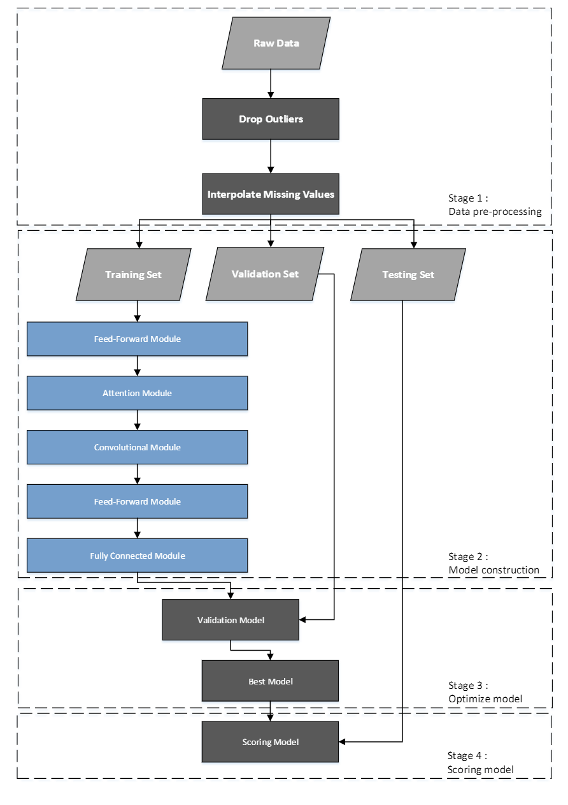

# Self-attention-and-Convolution-Model
* This work can be found in  [[Renewable Energy]](https://www.sciencedirect.com/science/article/abs/pii/S0960148123013149).

📍 This work proposes a wind power prediction model, in which the proposed model uses self-attention to capture the long-range relationship and uses convolutional layers to learn the local temporal interactions of the variables in the time-series data.

📍 Compared to deep learning sequence models, such as recurrent neural network (RNN), long short-term memory (LSTM), and gated recurrent unit (GRU), the proposed method can simultaneously consider global and local information.

# Model

📍 It comprises a feedforward module, an attention module, and a convolution module. Our proposed model is inspired by the Transformer [[1]](https://arxiv.org/abs/1706.03762).

📍 The proposed model mainly uses self-attention to capture long-range relationships by repeatedly stacking self-attention modules, but the local temporal correlation is also important in time-series forecasting.

📍 Thus, we also use the convolution module to enhance the acquisition of local features.

# Training
## Dataset
The data used in the wind power prediction task belong to time-series data, which means that a series of data points are collected over time. We introduce the notation for time series data at different time steps as ***x1, x2, . . . , xT*** to denote time series data of length ***T***, each time steps has ***D*** dimensions.

## Setting

## Comparison Methods
we use several methods that are often used in wind energy forecasting as comparison methods.

* A2-Nets [[2]](https://proceedings.neurips.cc/paper_files/paper/2018/file/e165421110ba03099a1c0393373c5b43-Paper.pdf)
* MLPX [[3]](https://arxiv.org/abs/2105.01601)
* ARIMA
* LetNet-5
* ResNet8
* A2-Nets
* RNN
* GRU
* LSTM
* Transformer

# Results
# result of prediction

The result of the forecast performance shows that the prediction values are close to the true values, indicating that the proposed model has successfully captured the information on the short-term information.

# compare to others 

our proposed method outperforms other alternatives in all metrics.

